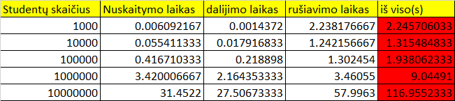

# Tyrimas 1

Failų (1000, 10000, 100000, 1000000, 10000000) generavimas vidutiniškai (imant trijų generavimų vidurkį) užtruko 46.6222 s.

# Tyrimas 2

visi testai buvo atliekami po 3 kartus ir paimtas jų vidurkis.

