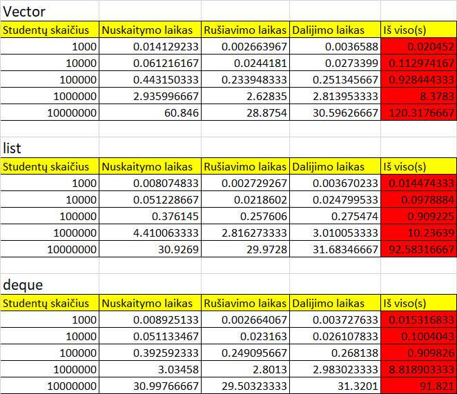

# Paleidimo instrukcija

1.Atsisiųskite programos versiją iš Releases.

2.Išarchyvuokite failus.

3.Atsidarykite aplankalą.

4.1 Norint pasileisti programą per terminalą - užkomentuokite pirmą "duomenys.h" eilutę ir atkomentuokite antrą "duomenys.cpp".

   4.1.2 Norint sukompiliuoti programą per terminalą, įveskite komandą `g++ -O3 -o programa pirma_uzd.cpp`.

   4.1.3 Norint paleisti programą, per terminalą įveskite komandą `./programa`.

   4.2 Norint pasileisti programą per jūsų pasirinktą editorių - užkomentuokite antrą "duomenys.cpp" eilutę ir atkomentuokite pirmą "duomenys.h".

# V.04 užduotis {

# Tyrimas 1

Failų (1000, 10000, 100000, 1000000, 10000000) generavimas vidutiniškai (imant trijų generavimų vidurkį) užtruko 46.6222 s.

# Tyrimas 2

visi testai buvo atliekami po 3 kartus ir paimtas jų vidurkis.

# V.04 pabaiga}

# V1.0 užduotis {

CPU:Intel(R) Core(TM) i7-10510U CPU @ 1.80GHz   2.30 GHz

RAM: 16.0 GB

SSD:KXG6AZNV512G TOSHIBA M.2 2280 

